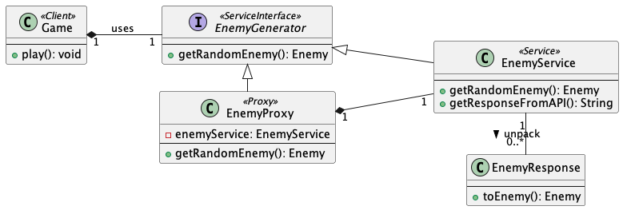
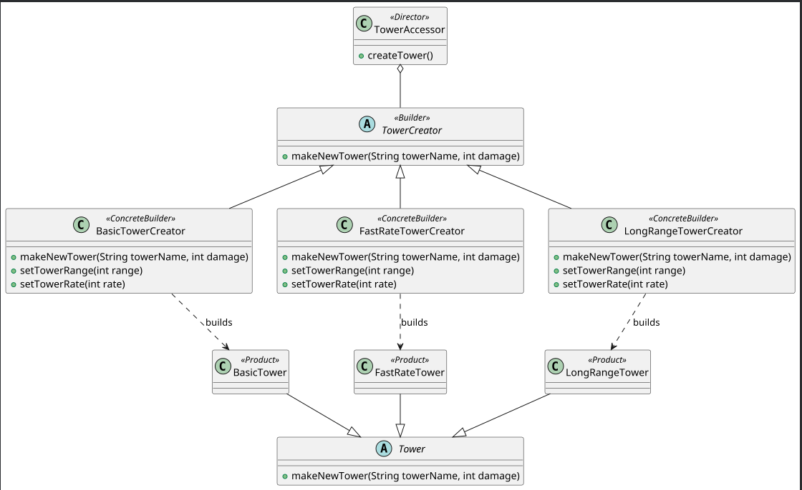
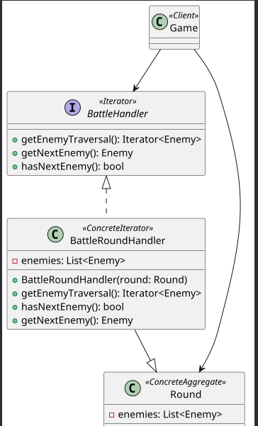
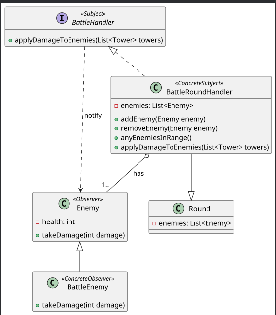
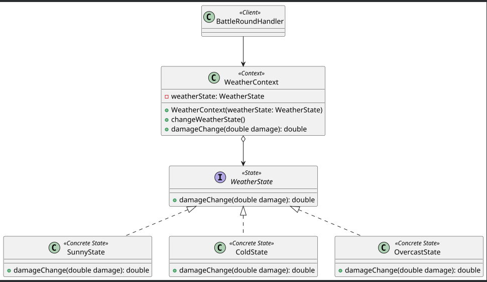
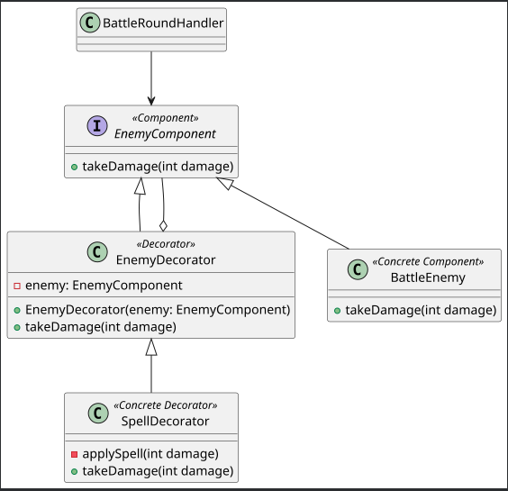

# SENG301 Assignment 4 (2025) - Student answers

Anh Le

## Statement on usage of Generative AI

I disclose that I did use GenAI for this assignment.

If I used GenAI, I did it for:

- Explaining the design patterns and find the best fit participants that match the GoF cards in the Tower Defence app. 
(Give the example for Builder and Factory Method, what is the difference between them).
(Give the example for State and Strategy, what is the difference between them).
- Assisting me in checking grammar and spelling in my answers. 
(I paste the text into the GenAI tool to check grammar and spelling, but I keep the idea of my answers.)

## Task 1 - Identify the patterns in the code

### EXAMPLE PATTERN (this pattern is given as an example)

#### What pattern is it?

Proxy

#### What is its goal in the code?

This proxy pattern is used in the Tower Defence app to:

- obtain enemies from an external system;
- cast the enemies from their API representation to the app's representation.

#### Name of UML Class diagram attached

Note that the association in the UML diagram contains a composition instead of an aggregation (as in the refactoring guru) or a directed association (in the reference card). You have to represent the pattern in its implemented form, i.e. as it is in the code, to get the full marks.

#### Mapping to GoF pattern elements

| GoF element | Code element        |
| ----------- | ------------------- |
| Client      | Game                |
| Subject     | EnemyGenerator        |
| Proxy       | EnemyProxy            |
| RealSubject | EnemyService          |
| request()   | getRandomEnemy()      |

### Pattern 1

#### What pattern is it?

Builder

#### What is its goal in the code?

This Builder pattern is used in the Tower Defence app to:
- let the TowerAccessor class create different types of towers with the same construction steps.
- create different types of towers (BasicTower, FastRateTower, LongRangeTower) with specific attributes (range, rate, damage) 
without exposing the construction logic to the client.
- allow to create towers with different attributes (range, rate, damage) but still be the same type (BasicTower/LongRangeTower/FastRateTower).

#### Name of UML Class diagram attached

#### Mapping to GoF pattern elements

| GoF element     | Code element                                    |
|-----------------|-------------------------------------------------|
| Director        | TowerAccessor                                   |
| Builder         | TowerCreator                                    |
| ConcreteBuilder | BasicTowerCreator                               |
| ConcreteBuilder | FastRateTowerCreator                            |
| ConcreteBuilder | LongRangeTowerCreator                           |
| Product         | LongRangeTower                                  |
| Product         | BasicTower                                      |
| Product         | FastRateTower                                   |
| Construct()     | creatTower()                                    |
| BuildPart()     | makeNewTower(), setTowerRange(), setTowerRate() |

### Pattern 2

#### What pattern is it?

Iterator

#### What is its goal in the code?

This Iterator pattern is used in the Tower Defence app to:
- allow the Game to traverse the enemy list without knowing its internal structure.
- provide a way to access the enemy elements of an aggregate calculation sequentially without exposing its underlying representation.

For this pattern, as the BattleHandler interface includes the getNext(), hasMore() methods that can be the Iterator, also
it has the getEnemyTraversal(): Iterator<Enemy> that can be the Aggregate. Besides, there is no other interface in this 
codebase that can match to the structure template, so I put the BattleHandler interface be both the Aggregate and Iterator as it meets the requirements 
of both interface. 
Otherwise, I would choose the ArrayList interface from the Java Collections Framework as the Aggregate. But as to be suggested 
in the lab session, it is said that the ArrayList interface is not a good choice in this assignment, so I choose the BattleHandler interface instead.
It doesn't fit with the Iterator pattern in terms of GoF, but I think it serves the purpose of the Iterator pattern in this codebase.
#### Name of UML Class diagram attached

#### Mapping to GoF pattern elements

| GoF element       | Code element                      |
|-------------------|-----------------------------------|
| Client            | Game                              |
| Aggregate         | BattleHandler                     |
| ConcreteAggregate | Round                             |
| Iterator          | BattleHandler                     |
| ConcreteIterator  | BattleRoundHandler                |
| next()            | getNextEnemy()                    |
| CreateIterator()  | getEnemyTraversal(), getEnemies() |

### Pattern 3

#### What pattern is it?

Observer

#### What is its goal in the code?

This Observer pattern is used in the Tower Defence app to:
- ensure that enemies are updated when applying damage to them.
- allow enemies can be added or removed from the list of subscribers
- allow the BattleRoundHandler to notify enemy to update enemy's health when enemy takes damage.

#### Name of UML Class diagram attached

#### Mapping to GoF pattern elements

| GoF element      | Code element           |
|------------------|------------------------|
| Subject          | BattleHandler          |
| ConcreteSubject  | BattleRoundHandler     |
| Observer         | Enemy                  |
| ConcreteObserver | BattleEnemy            |
| notify()         | applyDamageToEnemies() |
| attach()         | addEnemy()             |
| detach()         | removeEnemy()          |
| subjectState     | enemies: List<Enemy>   |
| observerState    | heath: int             |
| update()         | takeDamage()           |

## Task 2 - Discuss design

The BattleRoundHandler is not a well design as it violates the SOLID principles:
- S-Single Responsibility Principle (SRP): the class currently takes more than 1 job: traversal enemies list,
  calculating enemies health and checking whether there is any enemies in distance range.
  That means there are more than 1 reason to change the class, which is not good in further remaining.
  We can split this big class into smaller classes such as: BattleRoundCheckEnemyAlive class for calculating damage on enemy's health and
  BattleRoundHandler for traversing and checking if any enemy alive.
- O-Open/Closed Principle (OCP): The class is not easily extendable for new behaviors (e.g., new ways to apply damage or check enemy status) 
  without modifying existing code.
- L-Liskov Substitution Principle (LSP): the method getEnemies() is override inside BattleRoundHandler class, which makes different behavior.
  If we cast BattleRoundHandler object to Round object, calling getEnemies() method will return the list of enemies which is not expected
  in BattleRoundHandler object. This violates the rule that a subclass should be substitutable for its parent class.
- I-Interface segregation principle (ISP): this class has getEnemies() method and attributes (getRoundId, getNumber, getPlayer) that are never used.
  These attributes and method becomes redundant when we implement. By following this principle, we can create an interface
  that contains only interested attributes and methods. Then instead of inheriting the whole Round class, BattleRoundHandler implements the new interface
- D-Dependency inversion principle (DIP): BattleRoundHandler class depends on the BattleEnemy implementation (this.enemies.add(new BattleEnemy(enemy))).
  BattleEnemy is a concrete class so it violates principles saying that high-level modules should not depend on low-level modules 
  and both should depend on abstractions.

## Task 3 - Implement new feature 1

### What pattern fulfils the need for the feature?

State pattern

### What is its goal and why is it needed here?

The goal of the State pattern in this context is to manage the different weather conditions that affect tower damage in the game. 
Each weather condition (cold, overcast, sunny) can change how much damage a tower does, and the State pattern allows us 
to encapsulate these conditions as separate states. 

This way, we can easily switch between different weather states without modifying the tower's logic directly.
The State pattern is used to represent and manage damage over different weather conditions. It allows encapsulating weather 
condition as a state and enabling battle change tower damage without changing tower logic directly.

This pattern is chosen as it keeps track the internal state weather changes after each round step, and this changing is made by the
BattleRoundHandler. No external control outside BattleRoundHandler class is needed.

### Name of UML Class diagram attached

### Mapping to GoF pattern elements

| GoF element   | Code element       |
|---------------|--------------------|
| Context       | WeatherContext     |
| Client        | BattleRoundHandler |
| State         | WeatherState       |
| ConcreteState | ColdState          |
| ConcreteState | OvercastState      |
| ConcreteState | SunnyState         |
| Handle()      | damageChange()     |
| Request()     | damageChange()     |

## Task 4 - Implement new feature 2

### What pattern fulfils the need for the feature?

Decorator

### What is its goal and why is it needed here?

The goal of the Decorator pattern in this context is:
- to allow the addition of new behavior to BattleEnemy objects dynamically
by wrapping each enemy in round inside a spell decorator which updates the damage that enemy suffers.
- can add multiple spells to an enemy without modifying the original BattleEnemy class.
- can remove spell layer that already expired without affecting the original BattleEnemy class at runtime.

The Decorator pattern is chosen because it allows to add new behavior (applySpell) to the BattleEnemy class without modifying its structure.
And also allows to add multiple spells or remove the expired ones to an enemy depending on the condition at run time.
### Name of UML Class diagram attached

### Mapping to GoF pattern elements

| GoF element       | Code element   |
|-------------------|----------------|
| Component         | EnemyComponent |
| ConcreteComponent | BattleEnemy    |
| Decorator         | EnemyDecorator |
| ConcreteDecorator | SpellDecorator |
| Operation()       | takeDamage()   |
| AddedBehavior()   | applySpell()   |
